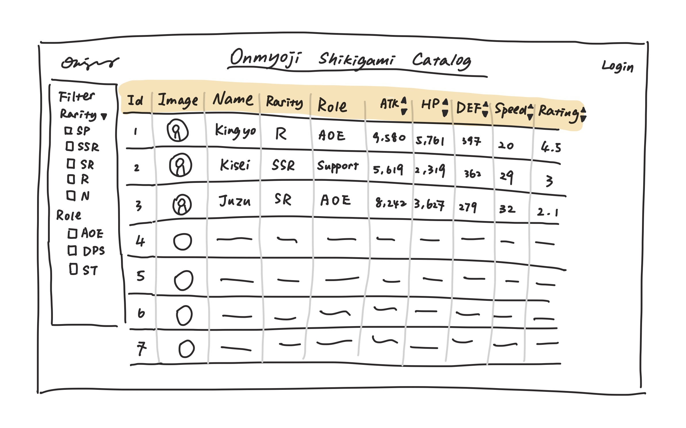

# Project 3: Design Journey

**For each milestone, complete only the sections that are labeled with that milestone.** Refine all sections before the final submission.

You are graded on your design process. If you later need to update your plan, **do not delete the original plan, rather leave it in place and append your new plan _below_ the original.** Then explain why you are changing your plan. Any time you update your plan, you're documenting your design process!

**Replace ALL _TODOs_ with your work.** (There should be no TODOs in the final submission.)

Be clear and concise in your writing. Bullets points are encouraged.

**Everything, including images, must be visible in _Markdown: Open Preview_.** If it's not visible in the Markdown preview, then we can't grade it. We also can't give you partial credit either. **Please make sure your design journey should is easy to read for the grader;** in Markdown preview the question _and_ answer should have a blank line between them.


## Design Plan (Milestone 1)

**Make the case for your decisions using concepts from class, as well as other design principles, theories, examples, and cases from outside of class (includes the design prerequisite for this course).**

You can use bullet points and lists, or full paragraphs, or a combo, whichever is appropriate. The writing should be solid draft quality.


### Catalog (Milestone 1)
> What will your catalog website be about? (1 sentence)

My catalog would be a catalog for the Shikigamis (Spirits) in the mobile game Onmyoji.


### _Consumer_ Audience (Milestone 1)
> Briefly explain your site's _consumer_ audience. Your audience should be specific, but not arbitrarily specific. (1 sentence)
> Justify why this audience is a **cohesive** group. (1-2 sentences)

My consumer audience would be the players of Onmyoji.

This audience is a cohesive group because they play the same mobile game Onmyoji. This shared interest may cause them to have very similar knowledge and experience with the game. They all want to learn the best strategies in the game. Moreover, they may even participate in online communities about the game to interact with other players.


### _Consumer_ Audience Goals (Milestone 1)
> Document your _consumer_ audience's goals for using this catalog website.
> List each goal below. There is no specific number of goals required for this, but you need enough to do the job (Hint: It's more than 1. But probably not more than 3.)
> **Hint:** Users will be able to view all entries in the catalog and insert new entries into the catalog. The audience's goals should probably relate to these activities.

Goal 1: Learn basic information about the Shikigamis

- **Design Ideas and Choices** _How will you meet those goals in your design?_
  - List all the Shikigamis' information and stats in a table
  - The table will include columns of image, name, and attacking and defensing stats.
- **Rationale & Additional Notes** _Justify your decisions; additional notes._
  - A table would be the best option to display the information because the catalog has a lot of numeric data.

Goal 2: Explore gaming strategies (find out which Shikigami is best fit for which kind of battle)

- **Design Ideas and Choices** _How will you meet those goals in your design?_
  - Include ATK, HP stats, and rating in the table.
- **Rationale & Additional Notes** _Justify your decisions; additional notes._
  - The columns about ATK, HP provides the users an idea of the Shikigami's battle performance.
  - The column rating considers the opinions of authoritative experienced players and rates the Shikigami on a scale of 10.

Goal 3: Learn more detail about a specific Shikigami

- **Design Ideas and Choices** _How will you meet those goals in your design?_
  - Set up a separate page for each Shikigami row in the table so that the user could tap on a row and view a detailed version of the entry on a new page.
  - The additional information includes Defense and Speed data and role and rarity information.
- **Rationale & Additional Notes** _Justify your decisions; additional notes._
  - A table could only provide basic information, to allow the users learn about particular Shikigamis better, more detailed information would be listed on a separate page.

### _Consumer_ Audience Device (Milestone 1)
> How will your _consumer_ audience access this website? From a narrow (phone) or wide (laptop) device?
> Justify your decision. (1 sentence)

Wide (laptop) device.
The users visits my website to plan for the best gaming strategy. This means they would access the website only if they had plenty of time to devote to the game and wished to sit down and study the game structure. The catalog is huge with numerous data, they would not hope to study the stats on a narrow screen.


### _Consumer_ Persona (Milestone 1)
> Use the goals you identified above to develop a persona of your site's _consumer_ audience.
> Your persona must have a name and a face. The face can be a photo of a face or a drawing, etc.


Tim

**Factors that Influence Behavior:**

- 5 years avid Onmyoji player
- Enthusiastic about the game, devote at least 12 hours to the game weekly
- Loves to explore new battling strategies and post them online to discuss with game-mates

**Goals:**

- Get the newest information on Shikigamis (newly published Shikigamis, upgrades,...)
- Learn new battling combinations and tips, and develop his own

**Obstacles:**

- There is no catalog-like website currently organizing all the information (including ratings) about the Shikigamis
- The game frequently releases new Shikigamis, many walkthroughs and strategies posts cannot take in the upgraded content into consideration in a timely manner

**Desires:**

- Needs a catalog website that includes all the stats and gaming tips about the Shikigamis
- The information needs to be up to date


### _Administrator_ Audience (Milestone 1)
> Briefly explain your site's _administrator_ audience. Your audience should be specific, but not arbitrarily specific. (1 sentence)
> Justify why this audience is a **cohesive** group. (1-2 sentences)

The developers of Onmyoji (employees of NetEase Gaming).

This is a cohesive group because those people are coworkers who develop Onmyoji together. They share the same goal of maintaining the game and the gaming community.

### _Administrator_ Audience Goals (Milestone 1)
> Document your _administrator_ audience's goals for using this catalog website.
> List each goal below. There is no specific number of goals required for this, but you need enough to do the job (Hint: It's more than 1. But probably not more than 3.)
> **Hint:** Users will be able to view all entries in the catalog and insert new entries into the catalog. The audience's goals should probably relate to these activities.

Goal 1: Help the players to develop gaming strategies

- **Design Ideas and Choices** _How will you meet those goals in your design?_
  - Provide reliable and accurate information about the Shikigamis to the players
  - Display the information in a table
- **Rationale & Additional Notes** _Justify your decisions; additional notes._
  - It is best to layout the statstics as a table

Goal 2: Add new entries of newly released Shikigamis to the database

- **Design Ideas and Choices** _How will you meet those goals in your design?_
  - Allow the administrators to insert entries through a form after login
- **Rationale & Additional Notes** _Justify your decisions; additional notes._
  - Login is to verify the identity of the adminstrator to keep the database trustworthy and accurate
  - A form is the best way to input data into the table.


### _Administrator_ Persona (Milestone 1)
> Use the goals you identified above to develop a persona of your site's _administrator_ audience.
> Your persona must have a name and a face. The face can be a photo of a face or a drawing, etc.


Kevin

**Factors that Influence Behavior:**

- Junior Software developer at NetEase
- Currently maintaining the operation of Onmyoji

**Goals:**

- Build an Onmyoji gaming community where players could explore their own ways of gaming

**Obstacles:**

- No platform providing and organizing useful information of Shikimagis, the most important components in the battling game.

**Desires:**

- Organize Shikimagis information on a website for the public to view
- Update the catalog timely, especially after any major updates of the game

### Catalog Data (Milestone 1)
> Using your personas, identify the data you need to include in the catalog for your site's audiences.
> Justify why this data aligns with your persona's goals. (1 sentence)

To use the catalog effectively, Tim would need these columns:

- Name of the Shikimagi
- Image of the Shikimagi
- ATK
- HP
- Defense
- Speed
- Rating (out of 10)

He also needs tags about the role and rarity of Shikigami so that he could get an idea of what positions the Shikigamis could take in the battle, how hard they are to obtain and more importantly, he could use the tags to filter through the Shikagamis.

As the developer of the game, Kevin is able to accurately provide these stastics.
With these columns, Tim could accomplish his goal of learning the newest information on Shikigamis. Furthermore, with ATK, HP, Defesne, Speed, and taking Rating as reference, Tim could develop his own evaluation towards the Shikimagis, and then develop his own gaming strategy. In this way, Kevin's goal of supporting the players to develop their own gaming strategy is also accomplished.


### Site Design (Milestone 1)
> Design your catalog website to address the goals of your personas.
> Sketch your site's design:
>
> - These are **design** sketches, not _planning_ sketches.
> - Use text in the sketches to help us understand your design.
> - Where the content of the text is unimportant, you may use squiggly lines for text.
> - **Do not label HTML elements or annotate CSS classes.** This is not a planning sketch.
>
> Provide a brief explanation _underneath_ each sketch. (1 sentence)
> **Refer to your persona by name in each explanation.**

**Home Page**

<!--Originally Created by Amy Yiwen Zhang-->
This is a very common design of a catalog table where a huge table is displayed and on its left side Tim could apply filter to it.

<!--Originally Created by Amy Yiwen Zhang-->
This design is a little different from the previous one as it has the filter section on the right side. In this way, Tim's sight would not be blocked by the filter section when he took the first glance at the page. The navigation bar is located under the title of the page, this makes navigating to different pages easier.

<!--Originally Created by Amy Yiwen Zhang-->
This design is quite distant from a table catalog. The good thing is that it provides a better visualization of the Shikigamis, but it doesn't seem to be very useful when there are a lot of numerical statistics that need to be displayed at the same time for all entries.

<!--Originally Created by Amy Yiwen Zhang-->
This is the page where all entries are displayed. It does not require login to view so both Tim and Kevin could view it. Tim could tap on the name of a Shikimagi and he will be navigated to the detail page. This page applies a common catalog design: when Tim accesses the home page, the first thing he sees is the table on the left side, so he can view all the Shikigamis at first glance, then as he navigates on the page, he sees the filter section on the right where he could filter through the entries.
As for the navigation bar, I chose the common design of locating the navigation section at the top right corner. This is because for most of the websites, the login button is usually located at the top right corner, Tim is very familiar with this kind of design. I also added a footer to the page so that all the data would be credited to the produced of the game, NetEase.

**Detail Page**

<!--Originally Created by Amy Yiwen Zhang-->
This design inherits the table style from the home (view all) page. The columns list the data out very clearly.

<!--Originally Created by Amy Yiwen Zhang-->
This design looks like a "resume" page for Shikagami. It puts the Shikagai's picture on the left and all the text on the right sight. It also considers Tim's reading habit and catches his eyes by making the section centered.

<!--Originally Created by Amy Yiwen Zhang-->
The design is an alternative to design 2, it uses spaces to divide up different types of information. The tags are put underneath the picture, and the numerical data are located on the right side. And the rating, which is the most important piece of information, is displayed at the center acting as a conclusion to the Shikagami.

<!--Originally Created by Amy Yiwen Zhang-->
This page inherits the header and footer design of the home page to provide Tim with a sense of consistency. It displays all detailed stats about one specific Shikimagi. I decided not to use a table form because, with only one entry, the page looks empty and boring. It would be more appealing to Tim if he meets the Shikagami as if they exist as real people in the world. So I chose to make it like a "resume" page. Additionally, I tried to make significant information stand out on the page: I put the rating as a single row underneath the picture with a bigger font. On the right side is some supplementary stats describing the Shikigami, but if Tim could only take one thing from this page, this positioning would make him remember the rating of the Shikigami.

**Login Page**

<!--Originally Created by Amy Yiwen Zhang-->
This is a very commonly used module for login. When Kevin clicks on the login at the top right corner, the login section would pop up.

<!--Originally Created by Amy Yiwen Zhang-->

<!--Originally Created by Amy Yiwen Zhang-->
Based on the sketch, I made the login a separate page. It is accessible by clicking the login button at the top right corner. I also emphasized that it is for the administrators to login instead of users in the page title. After logging in, the page would greet the administrator(Kevin) confirming that he has logged in. Correspondingly, the navigation bar would display the button for navigating to the insert form page.
The header and footer design inherits the design on the home page so that the design is consistent. The layout is like most of the login pages so Kevin is very familiar with the design and knows well what to do.

**Form Page**

<!--Originally Created by Amy Yiwen Zhang-->
This is a common design for an insert entry form module that pops up when Kevin click on the button "Insert". It fits the common reading pattern instructing Kevin to look from the left to the right, the left side provides instruction and the right side requires Kevin's input. The tags of role and rarity are added using two drop-down buttons allowing Kevin to choose from a given list of tags.

<!--Originally Created by Amy Yiwen Zhang-->
This alternative design mainly focuses on improving the flexibility of selecting tags. The drop-down button only allows Kevin to choose one tag attached to the Shikigami at a time, but in the game, many Shikigami have multiple and overlapping tags. This is solved by using checkboxes instead of drop-down buttons.

<!--Originally Created by Amy Yiwen Zhang-->
This page is where Kevin would add the new entries. The form follows Kevin's reading pattern in that it starts from the top left corner and ends at the right bottom corner with a submit. I chose to use the checkboxes for tags like in design sketch 2 so that Kevin could add as many tags to one Shikigami as he wants. However, in Sketch 2, the tags are put into 2 rows and it looks confusing and messy. Kevin may not be able to find the tag he desires quickly as he has to read through the rows. So I decided to make each tag take on a row. Although it consumes a lot of space, it helps to improve the efficiency of Kevin’s work.


### Catalog Design Patterns (Milestone 1)
> Explain how you used design patterns in your site's design. (1-2 sentences)

I chose the table catalog design pattern because the catalog includes multiple columns of numeric data and it would be easier for Tim to browse through the numbers if they are listed as a table. It is a common design that the catalog is located on the left of the page as most of the people including Tim have the reading habit of statring from the left side. After Tim has a glance at the view all entry page, he could filter through the Shikigamis based on the tags and find the one he desires using the filter section on the right side of the page.
As for the navigation bar, it is a familiar design pattern for both Tim and Kevin. It is commonly found at the top right corner of most websites, and this placement allows users who do not require or desire to login, such as Tim, to view the content without being distracted by the navigation bar. The login button is also typically located at the top right corner of the navigation bar for easy access.


## Implementation Plan (Milestone 1, Milestone 2, Milestone 3, Final Submission)

### Database Schema (Milestone 1)
> Plan the structure of your database. You may use words or a picture.
> A bulleted list is probably the simplest way to do this.
> Make sure you include constraints for each field.

Table: entry

- id: INTEGER {PK, U, NN, AI}
- name: TEXT {NN},
- atk: INTEGER {NN},
- hp: INTEGER {NN},
- def: INTEGER {NN},
- spd: INTEGER {NN},
- rating: REAL {NN}

Table: tags

- id: INTEGER {PK, U, NN, AI}
- tag_name: TEXT {NN}

Table: entry_tags

- id: INTEGER {PK, U, NN, AI}
- shikagami_id: INTEGER {NN}
- tag_id: INTEGER {NN}

### Database Query Plan (Milestone 1, Milestone 2, Milestone 3, Final Submission)
> Plan _all_ of your database queries.
> You may use natural language, pseudocode, or SQL.

```
CREATE TABLE "entry" (
  "id" INTEGER NOT NULL UNIQUE,
  "name" TEXT NOT NULL,
  "atk" INTEGER NOT NULL,
  "hp" INTEGER NOT NULL,
  "def" INTEGER NOT NULL,
  "spd" INTEGER NOT NULL,
  "rating" REAL NOT NULL,
  PRIMARY KEY("id" AUTOINCREMENT)
);
```

```
CREATE TABLE "tags" (
  "id" INTEGER NOT NULL UNIQUE,
  "tag_name" TEXT NOT NULL,
  PRIMARY KEY("id" AUTOINCREMENT),
);
```

```
CREATE TABLE "entry_tags" (
  "id" INTEGER NOT NULL UNIQUE,
  "shikagami_id" INTEGER NOT NULL,
  "tag_id" INTEGER NOT NULL,
  PRIMARY KEY("id" AUTOINCREMENT)
  FOREIGN KEY(`shikimagi_id`) REFERENCES entry('id'),
  FOREIGN KEY(`tag_id`) REFERENCES tags('id')
);
```

```
CREATE TABLE users (
  id INTEGER NOT NULL UNIQUE,
  name TEXT NOT NULL,
  username TEXT NOT NULL UNIQUE,
  password TEXT NOT NULL,
  PRIMARY KEY(id AUTOINCREMENT)
);
```

```
CREATE TABLE sessions (
  id INTEGER NOT NULL UNIQUE,
  user_id INTEGER NOT NULL,
  session TEXT NOT NULL UNIQUE,
  last_login TEXT NOT NULL,
  PRIMARY KEY(id AUTOINCREMENT) FOREIGN KEY(user_id) REFERENCES users(id)
);
```

## Complete & Polished Website (Final Submission)

### Accessibility Audit (Final Submission)
> Tell us what issues you discovered during your accessibility audit.
> What do you do to improve the accessibility of your site?

During my accessibility audit, I got contrast errors for the buttons of "Search" on the home page for the filter, the "Login" button on the login page, and the "Submit" button on the insert form page. These three buttons all belong to the class "button" and have the same CSS styling. The contrast errors suggest that the buttons' background color did not create a big enough contrast with the text color, hence it may not be clear enough to read. To resolve this problem, I changed the background color of the buttons to a darker brown and make the font color a brighter white. In this way, the buttons are more readable to both Tim and Kevin and therefore the accessibility of my site is increased.


### Self-Reflection (Final Submission)
> Reflect on what you learned during this assignment. How have you improved from Projects 1 and 2?

Through this assignment, I have gained valuable insights into various methods for implementing databases in websites. While in Project 2, I was only able to display all entries at once, in Project 3, I was able to incorporate filtering to allow for more specific searches and provide a detailed page for each entry. This has allowed me to provide users with more detailed and personalized information.

I am now much more familiar with PHP and its integration with HTML. By utilizing multiple "for each" loops, I have been able to minimize hard coding and create more efficient and dynamic code. Moreover, I have discovered the impressive capabilities of PHP in providing functions that would typically require JavaScript. For example, I was able to authenticate whether a user was logged in on a given page and display page-customized titles, all with PHP variables.
Overall, this assignment has expanded my understanding of database implementation and reinforced my appreciation for the versatility and power of PHP in web development.


> Take some time here to reflect on how much you've learned since you started this class. It's often easy to ignore our own progress. Take a moment and think about your accomplishments in this class. Hopefully you'll recognize that you've accomplished a lot and that you should be very proud of those accomplishments! (1-3 sentences)

Through this project, I have come to appreciate the vital role that a well-designed database schema plays in the backend of a website. The key for a successful schema is to avoid duplication and unmeaningful columns, which ultimately determines the efficiency and effectiveness of the database.
Furthermore, I have leanred how to incorporate images into the database and how to enable image uploads. This functionality has greatly enhanced the usability of my website and has expanded my toolkit as a developer.
Overall, this project has emphasized the significance of a strong database foundation and has equipped me with valuable skills to further improve the functionality and user experience of my future projects.


### Collaborators (Final Submission)
> List any persons you collaborated with on this project.

N/A

### Reference Resources (Final Submission)
> Please cite any external resources you referenced in the creation of your project.
> (i.e. W3Schools, StackOverflow, Mozilla, etc.)

StackOverflow - "How to use $_GET to get multiple parameters using the same name in PHP" - by Quentin
<https://stackoverflow.com/questions/4951448/how-to-use-get-to-get-multiple-parameters-using-the-same-name-in-php>

Mozilla - "input type=checkbox"
<https://developer.mozilla.org/en-US/docs/Web/HTML/Element/input/checkbox>

### Grading: User Accounts (Final Submission)
> The graders will need to log in to your website.
> Please provide the usernames and passwords.

**Administrator User:**

- Username: kevin
- Password: monkey

**Consumer User:**
The website does not support consumer log in.

- Username: N/A
- Password: N/A

**Note:** Not all websites will support consumer log in. If your website doesn't, say so.


### Grading: Step-by-Step Instructions (Final Submission)
> Write step-by-step instructions for the graders.
> The project if very hard to grade if we don't understand how your site works.
> For example, you must log in before you can delete.
> For each set of instructions, assume the grader is starting from /

_View all entries:_

1. / allows you directly view all entries
2. You could always navigate back to this page by clicking "Home" at the top right corner of the page

_View all entries for a tag:_

1. Check one of the checkboxes on the right side of home page (/)
2. Click the "Search" button

_View a single entry's details:_

1. Click on one of the underlined shikigami names in the "Name" column. (The cursor would change into a pointer to show that it is clickable)

_How to insert and upload a new entry:_

1. Click "Login" button at the top right corner of the page.
2. Log in using the following administrator information:
   1. username: kevin
   2. password: monkey
3. Click "Insert" button at the top right corner of the page.
4. Input values in the form. (All fields except the Source URL need to be filled)
5. Click "Submit" button at the bottom right corner.

_How to delete an entry:_

1. Did not implement.
